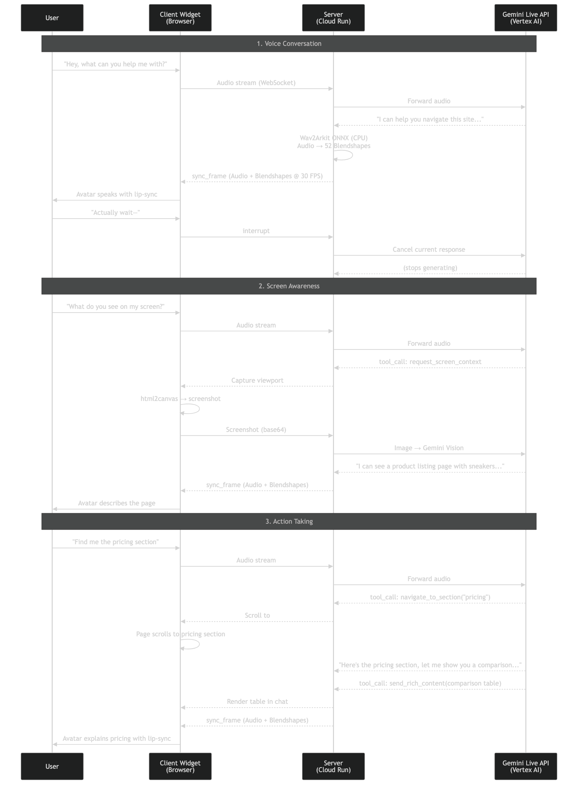

# Interactive Website Navigator

An action-taking, interactive **Gaussian Splatting 3D avatar** that can guide visitors around your website, see what you see, find items you're looking for, and act as an overall website assistant — powered by the **Gemini Live API**.

## Features

- **Real-time voice conversation** — Full-duplex audio via Gemini Live API with natural interruptions
- **Screen awareness** — Captures and understands the user's viewport via Gemini Vision
- **Action taking** — Navigates pages, scrolls to sections, shows rich content (cards, carousels, tables)
- **Photorealistic 3D avatar** — Gaussian Splatting rendering with 52-blendshape lip-sync (CPU-only, no GPU required)
- **Embeddable widget** — Single script tag, Shadow DOM, zero style conflicts
- **Knowledge grounding** — Pluggable knowledge base for domain-specific context

## Architecture



## Tech Stack

| Category | Technologies |
|----------|-------------|
| **Frontend** | TypeScript, Vite, Three.js, [@myned-ai/gsplat-flame-avatar-renderer](https://www.npmjs.com/package/@myned-ai/gsplat-flame-avatar-renderer) |
| **Backend** | Python, FastAPI, WebSockets, ONNX Runtime, [myned-ai/wav2arkit_cpu](https://huggingface.co/myned-ai/wav2arkit_cpu) |
| **AI** | Gemini Live API, Vertex AI |
| **Cloud** | Google Cloud Run, Cloud Storage, Artifact Registry |
| **Infra** | Docker (multi-stage), GitHub Actions CI/CD |

## Reproducible Testing Instructions

### Prerequisites

- [Node.js](https://nodejs.org/) 18+ and npm
- [Docker](https://docs.docker.com/get-docker/) 20.10+ and Docker Compose 2.0+ (or Python 3.10 + [uv](https://github.com/astral-sh/uv))
- A **Gemini API key** from [Google AI Studio](https://aistudio.google.com/apikey) (free)
- Chrome browser with microphone access

### 1. Start the Server

#### With Docker (Recommended)

```bash
git clone https://github.com/myned-ai/interactive-website-navigator.git
cd interactive-website-navigator/server

cp .env.example .env
```

Edit `.env`:
```
GEMINI_USE_VERTEX=false
GEMINI_API_KEY=your-api-key-here
AUTH_ENABLED=false
```

```bash
docker-compose up -d

# Wait for: "Server started on 0.0.0.0:8080"
docker-compose logs -f
```

#### Without Docker

```bash
cd interactive-website-navigator/server

curl -LsSf https://astral.sh/uv/install.sh | sh
uv sync

pip install -U "huggingface_hub[cli]"
mkdir -p src/pretrained_models
huggingface-cli download myned-ai/wav2arkit_cpu --local-dir src/pretrained_models

cp .env.example .env
# Edit .env: set GEMINI_USE_VERTEX=false, GEMINI_API_KEY, AUTH_ENABLED=false

uv run python src/main.py
```

### 2. Start the Client

```bash
cd interactive-website-navigator/client

npm install
npm run dev
```

Open the URL shown by Vite (typically `https://localhost:5173`). Click the avatar bubble, allow microphone, and start talking.

### What to Test

- **Voice conversation** — Ask anything; avatar responds with lip-synced audio
- **Screen awareness** — Ask "what do you see on my screen?"
- **Navigation** — Ask it to find something or navigate to a section
- **Rich content** — Avatar shows cards, tables, and carousels in the chat

## Project Structure

```
interactive-website-navigator/
├── client/    → Embeddable 3D avatar chat widget (npm package)
├── server/    → Real-time voice AI backend (Python/FastAPI)
└── infra/     → GCP deployment scripts and CI/CD
```

See [client/README.md](client/README.md) and [server/README.md](server/README.md) for technical deep dives.

## License

MIT — see [LICENSE](LICENSE).
