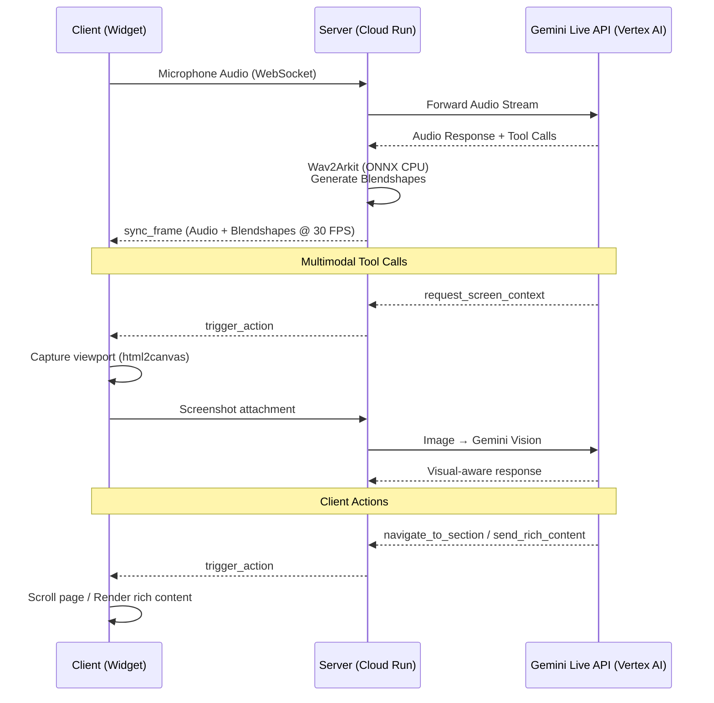

# Web Navigator Server

Backend server for the **Interactive Website Navigator** — an embeddable AI assistant that gives any website a photorealistic 3D avatar concierge powered by the **Gemini Live API** via **Vertex AI**.

The server receives user audio over WebSocket, forwards it to Gemini for real-time voice conversation, converts the AI's audio response into synchronized facial animations using a custom Wav2Arkit ONNX model, and streams paired audio + blendshape frames back to the client at 30 FPS.

## Features

- **Gemini Live API**: Real-time, full-duplex voice conversation via Vertex AI with native audio streaming and natural interruption
- **Lip-Sync Animation**: Custom Wav2Arkit ONNX model generates 52 ARKit-compatible blendshapes from audio in real-time on CPU
- **Sync Frame Protocol**: Server pairs each audio chunk with its corresponding blendshape frame into atomic `sync_frame` packets — guaranteeing perfect lip-sync regardless of network jitter
- **Multimodal Tools**: Screen context capture (viewport → Gemini vision), rich content projection (cards, tables, carousels), page navigation, and custom client actions
- **Knowledge Grounding**: Pluggable knowledge base (local file or URL) grounds the avatar in domain-specific context
- **Production Ready**: Docker multi-stage builds, HMAC-SHA256 authentication, rate limiting, health checks, structured logging

## Architecture



## Google Cloud Services

| Service | Purpose |
|---------|---------|
| **Cloud Run** | Hosts this server |
| **Vertex AI** | Gemini Live API access (no API key needed) |
| **Artifact Registry** | Docker image storage |

## Quick Start

### Local Development

```bash
# 1. Install uv package manager
curl -LsSf https://astral.sh/uv/install.sh | sh   # macOS/Linux
powershell -ExecutionPolicy ByPass -c "irm https://astral.sh/uv/install.ps1 | iex"  # Windows

# 2. Install dependencies
uv sync

# 3. Download the Wav2Arkit model
pip install -U "huggingface_hub[cli]"
mkdir -p src/pretrained_models
huggingface-cli download myned-ai/wav2arkit_cpu --local-dir src/pretrained_models

# 4. Configure environment
cp .env.example .env
# Edit .env — set GEMINI_USE_VERTEX=false and GEMINI_API_KEY for local dev

# 5. Run server
uv run python src/main.py
```

Server starts at `http://localhost:8080`

**Test the server:** Open `test.html` in your browser to test the widget with your local server. Make sure `AUTH_ENABLED=false` in your `.env` file for local testing.

### Prerequisites

- Python 3.10.x (exact version required)
- [uv](https://github.com/astral-sh/uv) package manager
- Google Gemini API key (for local development with AI Studio)
- Docker 20.10+ and Docker Compose 2.0+ (for containerized deployment)

### Docker

```bash
cp .env.example .env
# Edit .env with your settings

# Production
docker-compose up -d

# Development (hot reload)
docker-compose --profile dev up
```

## Configuration

All settings can be configured via environment variables or `.env` file. See [.env.example](.env.example) for the full template.

### Gemini Configuration

| Variable | Default | Description |
|----------|---------|-------------|
| `GEMINI_USE_VERTEX` | `true` | Use Vertex AI (recommended for Cloud Run) |
| `GEMINI_VERTEX_PROJECT` | *(auto-detected)* | GCP project ID |
| `GEMINI_VERTEX_LOCATION` | `us-central1` | Vertex AI region for Live API |
| `GEMINI_VERTEX_MODEL` | `gemini-live-2.5-flash-native-audio` | Model ID for Vertex AI |
| `GEMINI_API_KEY` | *(empty)* | API key (only when `GEMINI_USE_VERTEX=false`) |
| `GEMINI_MODEL` | `gemini-2.5-flash-native-audio-preview-12-2025` | Model ID for AI Studio |
| `GEMINI_VOICE` | `Kore` | Voice: `Puck`, `Charon`, `Kore`, `Fenrir`, `Aoede`, `Leda`, `Orus`, `Zephyr` |
| `GEMINI_THINKING_BUDGET` | `-1` | `0`=disabled, `-1`=dynamic, `1`–`32768`=fixed tokens |
| `GEMINI_GOOGLE_SEARCH_GROUNDING` | `false` | Enable Google Search grounding |
| `GEMINI_CONTEXT_WINDOW_COMPRESSION` | `true` | Enable compression for longer sessions |

### Server Configuration

| Variable | Default | Description |
|----------|---------|-------------|
| `AGENT_TYPE` | `sample_gemini` | Agent type: `sample_gemini`, `remote` |
| `SERVER_PORT` | `8080` | Server port |
| `DEBUG` | `false` | Enable debug logging |
| `ONNX_MODEL_PATH` | `./pretrained_models/wav2arkit_cpu.onnx` | Path to ONNX model |

### Authentication

| Variable | Default | Description |
|----------|---------|-------------|
| `AUTH_ENABLED` | `true` | Enable HMAC token authentication |
| `AUTH_SECRET_KEY` | *(empty)* | Secret key for signing (`openssl rand -hex 32`) |
| `AUTH_ALLOWED_ORIGINS` | `localhost` | Comma-separated allowed origins |
| `AUTH_TOKEN_TTL` | `3600` | Token TTL in seconds |
| `AUTH_ENABLE_RATE_LIMITING` | `true` | Enable per-origin rate limiting |

## Docker Usage

### Multi-Stage Build

The Dockerfile uses a multi-stage build optimized for CPU-only production:

1. **Base Stage**: Python 3.10-slim with system dependencies, downloads pretrained models from HuggingFace
2. **Dependencies Stage**: Fast dependency installation with uv
3. **Production Stage**: Minimal image with non-root user, health checks
4. **Development Stage**: Hot reload support

### Production Deployment

```bash
# Build image
docker build -t web-navigator-server .

# Run (CPU-only)
docker run -d \
  --name web-navigator-server \
  -p 8080:8080 \
  --env-file .env \
  --restart unless-stopped \
  web-navigator-server

# View logs
docker logs -f web-navigator-server

# Health check
curl http://localhost:8080/health
```

## API Endpoints

| Method | Path | Description |
|--------|------|-------------|
| `GET` | `/health` | Health check |
| `GET` | `/inf` | Server info and status |
| `GET` | `/docs` | OpenAPI documentation (Swagger UI) |
| `GET` | `/redoc` | ReDoc documentation |
| `POST` | `/api/auth/token` | Generate HMAC auth token |
| `WS` | `/ws` | WebSocket endpoint |

## Authentication

The server uses **HMAC-SHA256 signed tokens** for WebSocket authentication. Tokens are origin-bound and time-limited.

### Flow

1. Client calls `POST /api/auth/token` — server validates the `Origin` header and returns a signed token
2. Client connects to `ws://host/ws?token=TOKEN` — server verifies signature and expiry
3. Connection accepted or rejected

```bash
# Request token
curl -X POST http://localhost:8080/api/auth/token \
  -H "Origin: https://yourwebsite.com"

# Response
# {"token": "base64-encoded-hmac-token", "ttl": 3600, "origin": "https://yourwebsite.com"}
```

### Security Layers

1. **Origin Validation** — Whitelist check against `AUTH_ALLOWED_ORIGINS`
2. **HMAC Token Verification** — Signature and expiry validation
3. **Rate Limiting** — Token bucket algorithm (per-domain: 100 capacity @ 10/sec, per-session: 30 capacity @ 5/sec)
4. **Audit Logging** — All auth events logged

### Generate Secret Key

```bash
openssl rand -hex 32
```

## WebSocket Protocol

Connect to `/ws` (or `/ws?token=TOKEN` with authentication enabled).

### Client → Server

| Type | Description |
|------|-------------|
| `audio_stream_start` | Start audio streaming (includes `userId`) |
| `audio` | Audio chunk (base64 PCM16) |
| `text` | Text message to AI |
| `client_event` | Custom event with `name`, `data`, `directive` |
| `interrupt` | Explicitly interrupt AI response |
| `ping` | Heartbeat |

### Server → Client

| Type | Description |
|------|-------------|
| `config` | Negotiated audio settings (sent on connection) |
| `audio_start` | AI response started |
| `sync_frame` | Audio + 52 ARKit blendshape weights at 30 FPS |
| `audio_end` | AI response finished |
| `transcript_delta` | Streaming text with timing offsets |
| `transcript_done` | Complete transcript for a turn |
| `tool_call` | AI triggered an action (confetti, navigation, rich content) |
| `interrupt` | User interrupted AI |
| `pong` | Heartbeat response |

### Message Payloads

**`config`** — Sent on connection:
```json
{"type": "config", "audio": {"inputSampleRate": 16000}}
```

**`sync_frame`** — Synchronized audio + blendshapes at 30 FPS:
```json
{
  "type": "sync_frame",
  "weights": {"jawOpen": 0.3, "mouthSmile_L": 0.5, "...": "..."},
  "audio": "<base64-pcm16>",
  "sessionId": "...",
  "turnId": "...",
  "frameIndex": 0
}
```

The `weights` object contains 52 ARKit-compatible blendshape coefficients (0.0–1.0). See [ARKit Blendshape Documentation](https://developer.apple.com/documentation/arkit/arfaceanchor/blendshapelocation).

**`transcript_delta`** — Streaming text with timing offsets:
```json
{
  "type": "transcript_delta",
  "text": "Hello",
  "role": "assistant",
  "turnId": "...",
  "startOffset": 0,
  "endOffset": 312
}
```

**`interrupt`** — User interrupted AI response:
```json
{"type": "interrupt", "turnId": "...", "offsetMs": 1500}
```

## Agent Extensibility

The server uses a modular agent system. Implement `BaseAgent` for custom AI backends:

```python
from agents import BaseAgent, ConversationState

class MyAgent(BaseAgent):
    async def connect(self) -> None: ...
    def append_audio(self, audio_bytes: bytes) -> None: ...
    def send_text_message(self, text: str) -> None: ...
    async def disconnect(self) -> None: ...
```

Set `AGENT_TYPE=remote` and `AGENT_URL=ws://your-service/ws` for remote agents.

## Development

```bash
# Install dev dependencies
uv sync --group dev

# Lint + format + type check
uv run ruff check src/ --fix && uv run ruff format src/ && uv run ty check src/

# Run tests
uv run pytest
```

## License

MIT — see [LICENSE](LICENSE).

## Acknowledgments

- [Google Gemini](https://ai.google.dev/) — Live API for real-time voice AI
- [Apple ARKit](https://developer.apple.com/augmented-reality/arkit/) — Blendshape specification
- [LAM Audio2Expression](https://github.com/aigc3d/LAM_Audio2Expression) — Facial animation model
- [Wav2Vec 2.0](https://ai.meta.com/blog/wav2vec-20-learning-the-structure-of-speech-from-raw-audio/) — Speech representation learning
